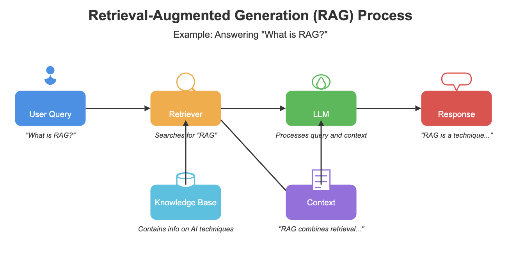
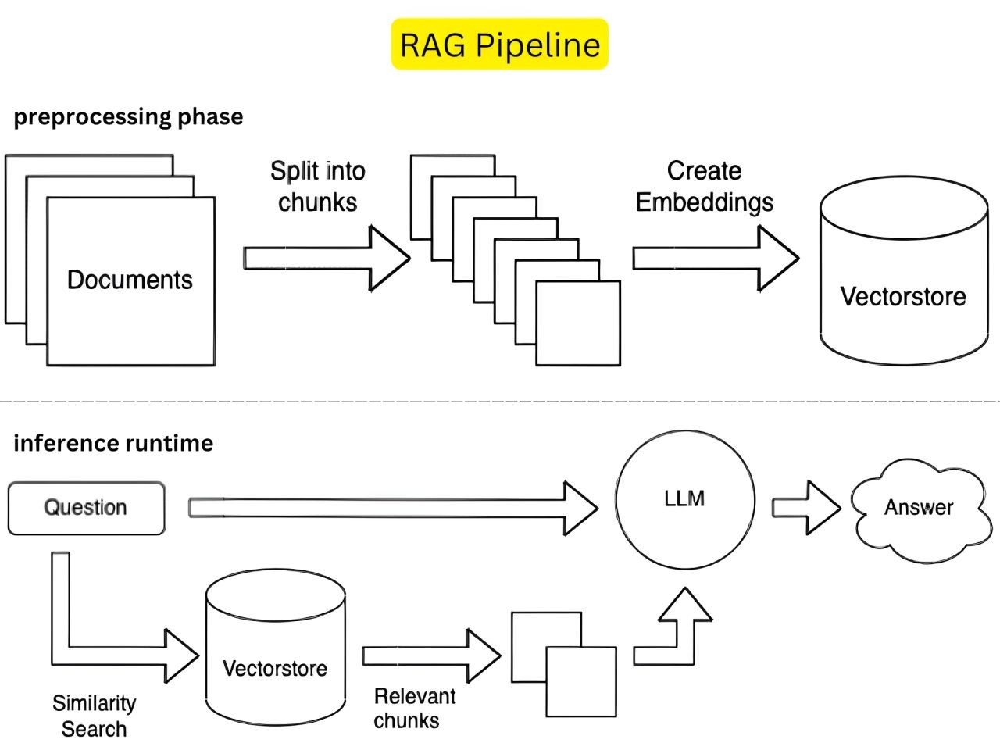

# Retrieval Augmented Generation - RAG

a. An AI Architecture that enhances or extends Large Language Models (LLMs) by combining them with External Knowledge.
b. LLMs rely on their internal data corpus and parameters to access information and Generate responses to the queries asked.
c. **RAG** allows LLMs to Access, Retrieve and Use up-to-date information from custom or external data sources before response generation.

## Key Components of a RAG Architecture

a. Document Collection
b. Document Chunking
c. Embedding Creation
d. Vectorize the Chunks
e. User Query
f. Search (Similarity, MMR)
g. Document Retrieval
h. Retrieved Documents + Original Query --> LLM --> Response Generation

## Why RAG?

1. **Improved Accuracy & Relevance** – RAG retrieves up-to-date or domain-specific information from external sources, reducing hallucinations and ensuring more accurate responses.
2. **Cost-Effective Knowledge Integration** – Instead of fine-tuning LLMs frequently, RAG dynamically pulls from existing databases (e.g., company docs, FAQs), saving training costs.
3. **Dynamic Knowledge Updates** – Unlike static LLMs, RAG can fetch the latest data without retraining (e.g., news, policy changes).
4. **Enhanced Transparency** – Since RAG cites sources, users can verify answers, increasing trust (useful in legal, medical, or customer support).
5. **Better Handling of Niche Topics** – Retrieves specialized data (e.g., internal manuals, research papers) that general LLMs might not know.

## Disadvantages of RAG

1. **Latency Issues** – Retrieval + generation adds delay compared to direct LLM responses.
2. **Dependency on Data Quality** – If the knowledge base is outdated or poorly indexed, RAG performs poorly.
3. **Complex Setup & Maintenance** – Requires good retrieval systems (e.g., vector databases) and constant updates to the knowledge base.
4. **Retrieval Failures** – If the system can't find relevant documents, the LLM may still hallucinate.
5. **Scalability Challenges** – Large-scale retrieval systems need significant computational resources.

## What could be the potential alternatives to consider for RAG

1. **Fine-Tuned LLMs** – Custom-trained models on specific data (but expensive and static).
2. **Prompt Engineering** – Carefully crafted prompts to guide LLMs (limited by the model's knowledge cutoff).
3. **Hybrid Models** – Combine RAG with fine-tuning for better performance.

- RAG + Model Fine Tuning (Specific Domains like Legal, Medical, Insurance, Fintech etc)

4. **Knowledge Graphs** – Structured data retrieval for precise, relational answers (e.g., in healthcare or finance).
5. **Multi-Model Systems** – Use specialized models for different tasks (e.g., classification + generation).

- Text + Vision Models (CLIP + GPT 4V), Speech2Text + LLM (Whisper Transcription + Llama3) etc

## RAG Architecture

### High Level Architecture

- Image Source: Datacamp.com

### RAG Pipeline

- Image Source: LinkedIn (Pavan Belagatti)

## RAG Frameworks

There are 2 popular frameworks that support the creation of RAG. Langchain and Llamaindex.

### Langchain

### LlamaIndex

## Vector Databases

### ChromaDB, FAISS, QDrant, Pinecone, Weaviate, Milvus, MongoDB etc

## Large Language Models

### OpenAI, Mistral, Qwen, Gemma, Llama, Deepseek, Gemini, Ollama etc

## Embeddings Libraires and Models

- Embeddings turn text/words into searchable numbers that are kind of a unique "fingerprint" that represent the Text.
- Each chunk of Text in RAG is converted to an Embedding that is stored in a Vector Database.
- When there are Questions asked, the Questions are turned into their own "fingerprint" of numbers.
- The Search is performed to find the closest matching numbers or "fingerprints".
- The context is then sent to the LLM as Text which then searches the best matching documents and frames its response.

### Libraries: HuggingFace, OpenAI, Jina AI etc

### Models: BAAI/bge-small-en, all-MiniLM-L6-v2, text-embedding-3-small, BERT, cc.en.300.bin, word2vec-google-news etc
